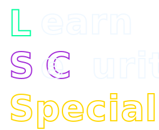

  

  <h2>Learn Security Specialist - 情報処理安全確保支援士の取得を目指す学習サイト</h2>

Learn Security Specialist は情報処理安全確保支援士を目指す方に向けた学習サイトです。 
応用情報技術者までの知識を有していることが前提ですが、単語の意味を忘れてしまっていてもその都度調べずに済むようにキーワードの解説なども入れております。
